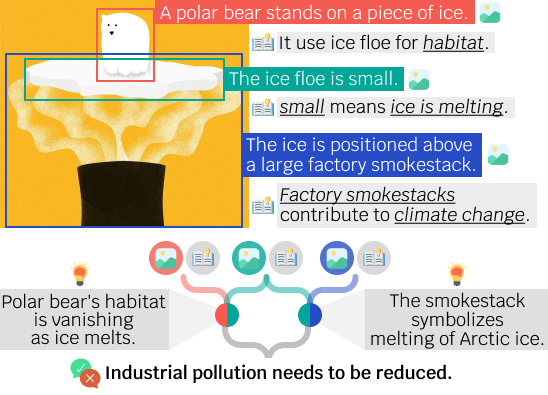

# Selective Vision is the Challenge for Visual Reasoning: A Benchmark for Visual Argument Understanding


<p align="center">
    
</p>

[Selective Vision is the Challenge for Visual Reasoning: A Benchmark for Visual Argument Understanding](https://arxiv.org/abs/2406.18925)

```
@article{chung2024selective,
  title={Selective Vision is the Challenge for Visual Reasoning: A Benchmark for Visual Argument Understanding},
  author={Chung, Jiwan and Lee, Sungjae and Kim, Minseo and Han, Seungju and Yousefpour, Ashkan and Hessel, Jack and Yu, Youngjae},
  journal={arXiv preprint arXiv:2406.18925},
  year={2024}
}
```

Please cite our work if you find our data helpful.

## Data

Our recommendation is to access the corpus on huggingface:

```python

from datasets import load_dataset

# load main data
dset = load_dataset("jiwan-chung/visargs", "annotations")

# load in the predefined negative sets for retrieval in the "Identification of Premises" task.
dset = load_dataset("jiwan-chung/visargs", "negatives")
```

Here's an example instance:

```
{
    'visual_premises': [
        'Mannequins in a store window wearing fur coats.',
        'Outside the window, foxes are looking at the fur coats with expressions of sadness and longing.',
        'There are dead foxes inside the window.'
    ],
    'bboxes': [
        {'h': 280, 'startX': 31, 'startY': 20, 'w': 362},
        {'h': 184, 'startX': 133, 'startY': 224, 'w': 325},
        {'h': 213, 'startX': 182, 'startY': 45, 'w': 248}
    ],
    'commonsense_premises': [
        'Animals, like foxes, are often killed for their fur, causing harm to wildlife populations.',
        'Seeing fur coats displayed on mannequins may evoke empathy from onlookers, especially those concerned about animal welfare.',
        'The juxtaposition of live foxes outside the window and dead foxes inside suggests a stark contrast between the reality of fur production and the idealized image presented by the store.'
    ],
    'conclusion': 'The image conveys a powerful message about the ethical implications of wearing fur, highlighting the suffering and loss experienced by animals in the fur industry.',
    'reasoning_steps': [
        '(VP1, CP1 -> IC1): The depiction of mannequins wearing fur coats implies the use of animal fur in fashion.',
        '(VP2, CP2 -> IC2): The expressions of sadness and longing on the faces of the foxes outside the window suggest empathy and emotional connection with the plight of animals.',
        '(IC2, VP3, CP3 -> IC3): The presence of dead foxes inside the window indicates the tragic consequences of fur production for wildlife.',
        '(IC1, IC3 -> C): By combining these visual and commonsense premises, the image effectively communicates the ethical concerns associated with wearing fur, urging viewers to consider the impact of their fashion choices on animal welfare.'
    ],
    'image': <PIL.JpegImagePlugin.JpegImageFile image mode=RGB size=460x456>
}
```

## Usage

1. Installation

```
    pip install torch>=2.1
    pip install -r requirements.txt
    pip install -e .
```

2. Data preprocessing

```
    python src/visarg/others/preprocess.py
```

3. Evaluation

We provide three complementary tasks for assessing the machine capacity of visual argument understanding.


- Task 1 (*Localization of Premises*)
```
    python src/visarg/main.py --task 1 --model_name $MODELNAME --grounding_type "openset"
    python src/visarg/main.py --task 1 --model_name $MODELNAME --grounding_type "closedset"
```

- Task 2 (*Idenfication of Premises*)
```
    python src/visarg/main.py --task 2 --model_name $MODENAME
```

- Task 3 (*Deduction of Conclusion*)

```
    python src/visarg/main.py --task 3 --model_name $MODELNAME --condition 0 --prompt_style 0
```
